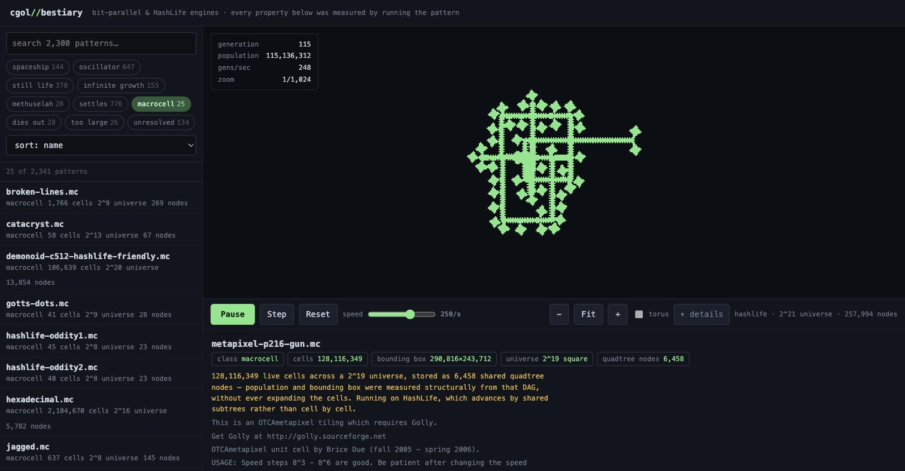

# cgol-bestiary

A browsable atlas of **2,341 Conway's Game of Life patterns**, in which every
property — period, speed, class, the generation a methuselah settles on — was
**measured by running the pattern**, never read from its comments. Two engines,
written in Rust and compiled to a single 82KB WebAssembly module.



<sup>The OTCA metapixel gun — a glider gun built out of Life cells that are
themselves made of Life. **128,116,349 live cells**, described by 6,458 shared
quadtree nodes, running in a browser tab. Its own file says it *"requires
Golly"*.</sup>

Historical bestiaries were full of secondhand claims copied from earlier
bestiaries. Every entry in this one was verified by observation: the
R-pentomino stabilises at generation **1103**, Acorn at **5206**, the glider is
**c/4 diagonal**, and the Demonoid builds a complete copy of itself after
**2,097,152** generations displaced exactly 4096 cells diagonally. Those numbers
are not transcribed from LifeWiki — they are what the engines computed, and they
agree with it.

## Try it

```sh
./fetch-patterns.sh                     # pull both corpora (not committed)
cargo run --release --bin index         # measure everything, write catalog.json
./build.sh                              # compile the wasm module
python3 -m http.server 8080 --directory www
```

Then open <http://localhost:8080>. Drag to pan, scroll to zoom, and
`space` `f` `d` `+` `-` `arrows` for play/pause, fit, collapse the details pane,
zoom and pan.

## Two corpora

| | count | source | engine | how it's measured |
|---|---|---|---|---|
| **RLE** | 2,316 | LifeWiki collection | bit-parallel bitmap | simulated — period, speed, class derived by running it |
| **Macrocell** | 25 | Golly's `Patterns/HashLife` | HashLife | measured structurally from the quadtree DAG |

Macrocell is Golly's format for patterns too large to write out at all.
`metapixel-p216-gun.mc` describes **128 million live cells in 30KB** — because
identical subtrees are shared, the whole universe is 6,458 quadtree nodes.
`src/macrocell.rs` parses that DAG and sums population and bounding box
*structurally*, memoising per node; nothing is ever expanded into cells. A node
used a million times is counted once and multiplied.

These cannot be run by the bitmap engine at all, so they run on HashLife —
see below.

## Two engines

The bitmap engine is unbeatable on small dense patterns and useless on a
universe 2^25 cells square. HashLife is the reverse. The catalogue records
which backend each pattern needs and the stage switches between them.

HashLife comes from [`golback`](https://github.com/favalosdev/golback) (MIT),
**vendored under `vendor/golback/`** — see `vendor/golback/VENDORED.md`. It is
committed pristine in one commit and modified in later ones, so `git log` on
that directory is exactly the diff against upstream.

The alternative, `gol_engines`, implements StreamLife and is the better
algorithm — but it depends unconditionally on tokio with `rt-multi-thread`,
which **does not compile to `wasm32-unknown-unknown`**. It can be made to, by
marking tokio optional and putting `mod quadtree_async` behind a feature (tokio
is confined to three files), but that means carrying a patch on a crate we'd
otherwise take unmodified.

### What we added upstream

**`visit_region`** — walk the tree, descending only into nodes that intersect
the viewport and stopping below a pixel. Rendering now costs *visible node
count*. The public alternatives were `to_coords`, which materialises every live
cell, and `is_alive` at ~290ms per megapixel — about 7fps on our viewport.

**`bounds`** — the bounding box from a walk memoised per node, so it costs
*distinct node count*. A node's box relative to its own corner doesn't depend
on where the node sits, which is what makes memoising across a shared DAG
sound; without it a walk revisits shared subtrees once per path through them.

Between them, nothing on the hot path costs population any more — population
itself is just the root node's count.

Exact rendering needs two constraints: cells-per-pixel rounded down to a power
of two, and the camera snapped to a multiple of it. Quadtree nodes are
power-of-two sized and aligned, so otherwise a node straddles two pixels and
the walk cannot say which to light.

Those constraints leak into the UI, which is why zoom is a **ladder** of
power-of-two rungs rather than ±1 on a scale factor. Stepping to a scale of -3
drew exactly the same picture as -2 — several presses appearing to do nothing —
and because the renderer's snap offset changed at each level while the camera
did not, the view jumped sideways by up to a full cells-per-pixel: two thousand
cells at the zoom a metapixel is viewed at, which read as an uncontrollable pan.
The camera is now snapped in the frontend by the same rule, with an unsnapped
float underneath it so that when zoomed in — where one screen pixel is a
fraction of a cell — small drags accumulate instead of rounding away.

**`ensure_room_for`** — the nastiest bug in this codebase. `centre()` already
wraps a node in one a level larger, but `advance_aux` immediately undoes that
with `successor()`, so the level never rose. A travelling pattern reached the
boundary and **decayed against it in silence**: a glider in a universe sized to
its own 3×3 box became a 2×2 block after 128 cells, and an undersized Gosper
gun reported 564 cells against a true 11,144. Growth now happens before
stepping, until the cells sit inside the central quarter and one `successor`
can span the jump. A glider runs 8,000,000 generations and travels exactly
2,000,000 cells with its population intact. The only real limit left is `i64`
coordinates at level 60, reported rather than allowed to corrupt anything.

**`combine` / `empty` / `CELL_ALIVE`** — enough to assemble a tree directly, so
a macrocell file can be loaded by **rebuilding its quadtree node for node**
rather than expanding it to coordinates. The two formats are the same structure:
a macrocell leaf is an 8×8 block and golback's levels are `log2(side)`, so
leaves become level-3 nodes and branches map one for one.

That removed the ceiling completely — all 25 patterns load, populations exact:

| | cells | load | nodes |
|---|---|---|---|
| `metapixel-p216-gun` | 128,116,349 | 0.003s | 8,008 |
| `metapixel-parity64` | 100,491,984 | 0.003s | 7,112 |
| `metapixel-galaxy` | 7,408,195 | 0.003s | 7,083 |

`parity64` previously needed 1.6GB of pairs and 14.6 seconds; `p216-gun` was out
of reach. Its own file says *"requires Golly"*.

The mapping carries a **deliberate vertical flip** — golback's `y` increases
northward while macrocell rows count downward, so macrocell `sw`/`se` become
golback's northern children. Get it backwards and the pattern is merely upside
down, which still looks like a plausible Life pattern and evolves into something
else. Both load paths are therefore compared directly, before and after
stepping.

### On garbage collection

golback's arena never shrinks, so the obvious worry is that long runs exhaust
memory. Measured on the 128M-cell metapixel, in wasm:

| generations | nodes | heap |
|---|---|---|
| 1M | 2.5M | 342 MB |
| 10M | 7.4M | 1,299 MB |
| 100M | 13.8M | 1,299 MB |
| 500M | 17.6M | 2,574 MB |

**Growth is strongly sublinear** — memoisation keeps hitting subtrees it has
already seen — and a chaotic soup is not the pathological case people expect: it
*settles*, after which the node count plateaus and stepping becomes instant.

So a collector is not what this corpus needs. Instead there is a 14-million-node
budget: stepping pauses, the UI says why, and Reset builds a fresh universe
which frees the lot. A real mark-and-sweep would only matter for someone running
a large pattern for hours.

### The payoff

`demonoid-c512-hashlife-friendly.mc`, a self-replicating spaceship. Advance it
2,097,152 generations and it has built a complete copy of itself, displaced
exactly 4096 cells diagonally at identical population — precisely what the
pattern's own header documents. That is 2 million generations across a
272,449 × 268,312 region; for the bitmap engine it is not a slow computation
but an impossible one.

## The engine

Cells are packed 64 to a `u64` and the rule is evaluated with nothing but
shifts, `AND`, `OR` and `XOR` — 64 cells per instruction sequence, no branches
anywhere in the hot loop.

The Life rule needs a neighbour *count*, but a bit only holds 0 or 1. The trick
is to store counts as **bit-planes**: a value in `0..=3` for 64 columns lives in
two words, one per bit position. Addition then becomes a logic circuit, and each
bitwise op runs 64 copies of that circuit at once.

**1. Horizontal windows.** For a row word `r`, `r << 1` is the left neighbour of
every column and `r >> 1` is the right. A full adder over the three gives a
2-bit sum of each 3-cell window:

```rust
let x = lft ^ cur;
(x ^ rgt, (lft & cur) | (rgt & x))
```

**2. Stack three rows.** Add the three 2-bit numbers, column by column, into a
4-bit total. Call it `S9` — every cell in the 3×3 box, *centre included*.

**3. The rule.** Counting the centre is what makes this collapse. A live cell
needs 2 or 3 neighbours, so `S9 ∈ {3, 4}`; a dead cell needs exactly 3, so
`S9 = 3`. The whole of Life is:

```rust
next = (S9 == 3) | (mid & (S9 == 4))
```

and equality on bit-planes is just ANDs of bits and their complements.

About 45 instructions per 64 cells — under one per cell, against roughly 15–20
per cell for the obvious implementation. Measured with `cargo run --release
--bin bench` on an M-series Mac:

```
naive   512×512  ×20      0.041s      129 M cell-updates/sec
bitwise 512×512  ×200     0.004s   12,487 M cell-updates/sec
bitwise 2048×2048 ×100    0.022s   19,187 M cell-updates/sec
```

Treat the ~150× with some suspicion: the naive baseline uses `%` for wrapping,
which is genuinely awful, and LLVM is very likely auto-vectorising the `u64`
loop into NEON. Against a tuned scalar version, expect closer to 30–50×.

The one gotcha is that `<<` drops the bit at the word edge, so column 0's left
neighbour has to be pulled out of the previous word:

```rust
let lft = (cur << 1) | (prev >> 63);
```

On a torus the row's last word *is* the previous word, so wrapping comes out for
free. Grids can also be [`Boundary::Dead`], where everything off-grid is
permanently dead — necessary for the showcase, because on a torus a gun's own
gliders come back around and demolish it.

## Measuring what a pattern is

`src/analysis.rs` fingerprints every generation with a translation-invariant
hash of the live cells. When a fingerprint recurs, the pattern has entered a
cycle, and the displacement between the two occurrences says which kind:

| displacement | first seen | verdict |
|---|---|---|
| none, period 1 | gen 0 | still life |
| none | gen 0 | oscillator |
| nonzero | gen 0 | spaceship — speed from displacement ÷ period |
| any | later | settles after a transient |

Two things that are easy to get wrong:

**Escaping gliders defeat configuration hashing.** Acorn's debris settles at
generation 5206, but six gliders fly away forever, so the *configuration* never
repeats and no amount of extra budget will find a cycle. What conventionally
counts as "stabilising" is the **population** becoming periodic, which is a
separate and much cheaper check. Adding it moved 228 patterns out of
`unresolved` and made the whole index run three times faster, because far fewer
patterns escalate to the expensive second pass.

**A dead boundary invalidates verdicts.** Simulation stops the moment a live
cell reaches within one of the edge, since past that point a birth could happen
off-grid and we would be classifying an artefact of the box rather than Life on
the infinite plane. Patterns that hit the edge while still growing are recorded
as infinite growth; the rest are honestly reported as `unresolved`.

Of 2,316 Conway patterns: 94% get a verdict, 134 remain unresolved, and 26 are
larger than the analyser's grid cap (the biggest is 3.1M × 2.7M cells).

## Testing

Bit tricks fail in ways that only surface hundreds of generations later, or
only at a word boundary. `tests/differential.rs` diffs the fast engine against
the naive one **every single generation**, across single-word rows, multi-word
rows, sparse and dense soups, and short grids.

`tests/analysis.rs` pins the classifier to published figures: the glider is
`c/4 diagonal`, the LWSS is `c/2 orthogonal`, the R-pentomino stabilises at
generation **1103** and Acorn at **5206**.

`tests/hashlife.rs` holds the third-party engine against the one we already
trust — same soup, cell for cell, every generation for 80 generations across
three densities. It also checks that one jump of 512 generations lands exactly
where 512 single steps do, which is what caught the universe-sizing bug, and
that macrocell populations survive the round trip from our structural count
through enumeration and tree rebuilding.

And the index is itself the largest test there is — computing the right period
for two thousand independently documented patterns is strong evidence the bit
arithmetic is correct.

```sh
cargo test --release
```

## Layout

| | |
|---|---|
| `src/bitgrid.rs` | the engine |
| `src/naive.rs` | one byte per cell — the test oracle |
| `src/analysis.rs` | classification by simulation |
| `src/pattern.rs` | RLE parsing, rule normalisation |
| `src/macrocell.rs` | quadtree DAG parsing, structural measurement |
| `src/hashlife.rs` | HashLife backend for the macrocell patterns |
| `src/ffi.rs` | raw C ABI for the browser (no wasm-bindgen) |
| `src/bin/index.rs` | builds `catalog.json` |
| `src/bin/bench.rs` | naive vs. bitwise throughput |
| `www/` | pattern browser and stage |

## Patterns and attribution

Neither corpus is committed — `fetch-patterns.sh` pulls both, `.gitignore`
excludes them.

- **RLE** from [thomasdunn/cellular-automata-patterns](https://github.com/thomasdunn/cellular-automata-patterns),
  which snapshotted `conwaylife.com/patterns/all.zip`. conwaylife.com itself
  sits behind a Cloudflare challenge that blocks automated access, so it should
  not be scraped directly.
- **Macrocell** from Golly's `Patterns/HashLife`, via a blobless sparse
  checkout of [AlephAlpha/golly](https://github.com/AlephAlpha/golly) — about a
  megabyte instead of cloning a whole application. The script gunzips the
  `.mc.gz` files so the Rust side never needs a gzip dependency, which matters
  because the same crate compiles to wasm.

Pattern files carry their original `#N`/`#O`/`#C` attribution and are the work
of the Life community; LifeWiki content is CC BY-SA 3.0. Carry that attribution
if you redistribute them.

Rules are normalised and filtered in both formats. RLE uses four spellings
(`B3/S23`, `b3/s23`, the old survival-first `23/3`, `S23/B3`) and 65 files are
other rules — HighLife, Life without Death, Maze. Four of the macrocell files
are the `fangtian` metacells, which run a non-totalistic rule
(`B3-jknr4ity5ijk6i8/S23-a4city6c7c`) and are rejected.

**0E0P is on none of these mirrors.** It appears to be LifeWiki-only, and it is
also the worst possible first target at 93 million cells — the reference
benchmark for it runs StreamLife across eight worker threads, which is exactly
what wasm cannot do. The Demonoid gives the same self-replication payoff at
106,639 cells.

## Threads left hanging

Please fork it and make something better. These are the loose ends, roughly in
order of how much fun they look, and each one is genuinely open rather than
half-finished:

- **Rolling row sums.** Each row's horizontal window sum is computed three
  times — as the row above, the middle, and the row below. A two-row rolling
  window should cut roughly a third of the work.
- **SIMD.** `v128` doubles the lane count, but wasm's vector shifts are
  *per-lane*, so carrying a bit across the lane boundary needs a shuffle.
- **The oversized RLE patterns.** 26 are still catalogued as `too-large` —
  routing them through HashLife is mostly plumbing now that it can hold anything.
- **Garbage collection**, if you ever want to run a large pattern for hours.
  Measured as unnecessary for this corpus (above), so it is a real
  mark-and-sweep-from-the-root job rather than a fire to put out.
- **StreamLife.** `gol_engines` implements it, and it is the better algorithm for
  patterns dominated by glider streams. Blocked on tokio, but the patch to gate
  it behind a feature is six lines and verified to compile for wasm.
- **Thumbnails** in the browser list, rendered by the indexer.
- **0E0P.** Goucher's self-replicating metacell is the one pattern I wanted and
  could not get: it appears on no scriptable mirror, only LifeWiki itself, which
  sits behind a challenge that blocks automated access. Drop
  `0e0p-metaglider.mc` into `www/patterns-mc/` and the HashLife backend should
  take it — it holds 128-million-cell patterns already. 93,235,805 cells.

If you do build on this, the differential tests are the part worth keeping. Two
independently written engines checked against each other cell by cell, and both
pinned to published Life results, is what made it possible to change the engine
twice without quietly breaking anything. Every bug in this repo's history was
caught that way, including three of my own that produced perfectly
plausible-looking wrong answers.
